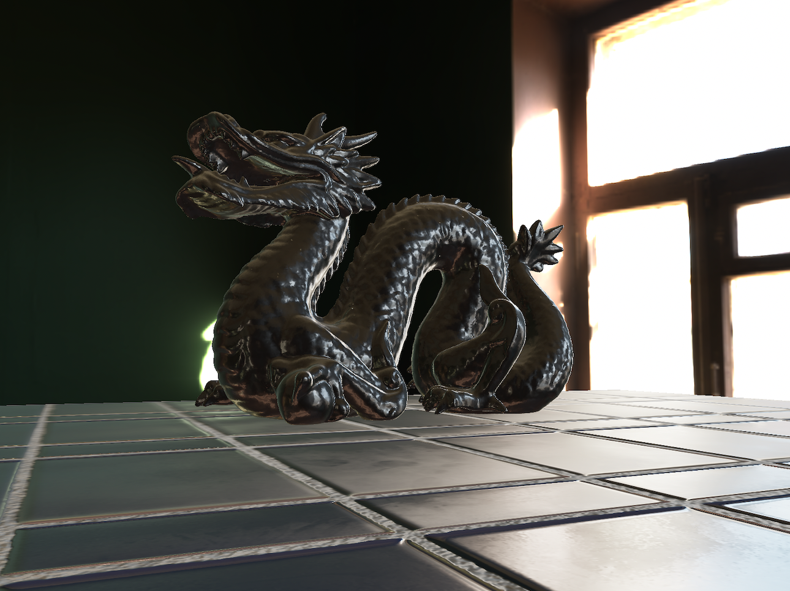
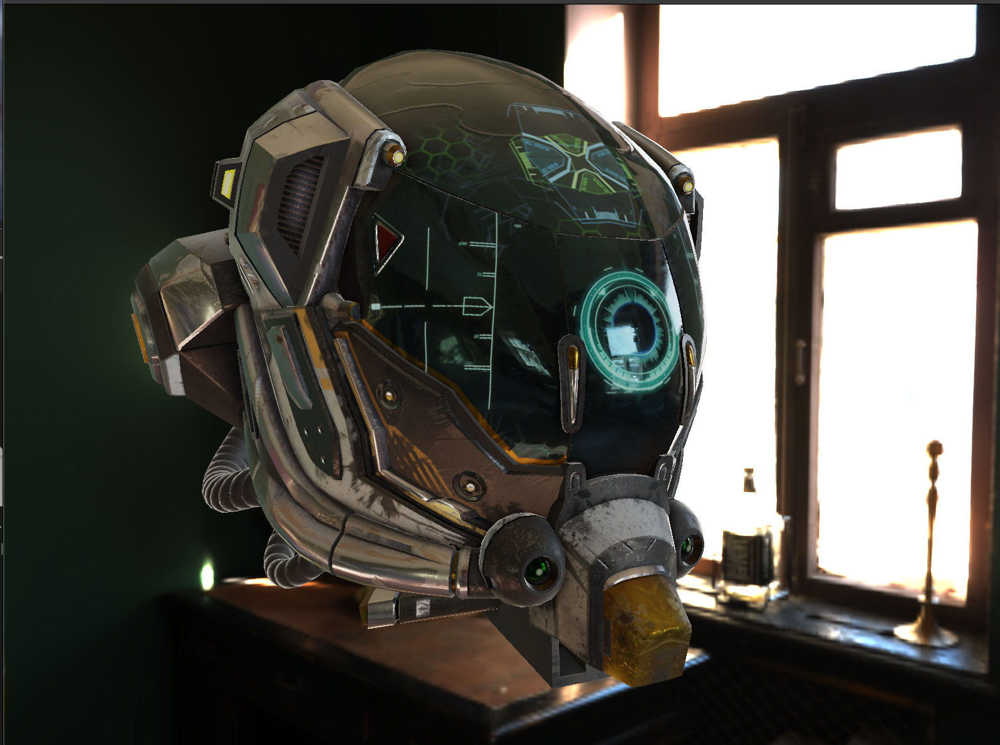

# PBR Lab

**PBR Lab** is an experimental learning OpenGL project that implements **Physically Based Rendering (PBR)** with **Image-Based Lighting (IBL)** from scratch.
All environment maps are generated using my custom **IBL Gen** tool, which produces the **Irradiance Map**, **Prefilter Map**, and **BRDF LUT** on the GPU.

## ✨ Features

- **Basic glTF PBR Pipeline**
  - Currently supports the standard glTF 2.0 metallic-roughness workflow
  - Core maps: albedo, normal, roughness, metallic, AO, emissive
- **Model Loading**
  - Load `.ply` files (via Assimp)
  - Load `.glb` / `.gltf` files (via TinyGLTF)
- **Geometry**
  - Built-in primitives: sphere and plane
- **Texture Handling**
  - Manual texture binding to material slots
  - Automatic PBR texture loading from model files
- **IBL Integration**
  - Supports irradiance map, prefilter map, and BRDF LUT
  - Maps generated with **IBL Gen** (self-developed GPU-based tool)

## 🚀 Roadmap

- **Advanced glTF Extensions**
  - Clearcoat  
  - Transmission  
  - (and more glTF PBR extensions in the future)
- **Extended BRDF Shader**
  - Anisotropic BRDF  
  - Clearcoat BRDF
- **Real-time Approximations**
  - Spherical Harmonics (SH) support for dynamic irradiance
- **Additional Features**
  - More built-in primitives and model formats
  - Improved debugging and visualization tools

## 📷 Screenshots

## 🛠️ Dependencies

- **Rendering & Assets**
  - [stb_image](https://github.com/nothings/stb): load 2D textures
  - [TinyGLTF](https://github.com/syoyo/tinygltf): load `.glb` / `.gltf` models
  - [Assimp](https://github.com/assimp/assimp): load `.ply` models
  - [gli](https://github.com/g-truc/gli): read `.ktx` environment maps and LUTs
- **Debug GUI**
  - [Dear ImGui](https://github.com/ocornut/imgui): in-engine debugging interface
- **Offline Tool**
  - **IBL Gen** (self-developed): My custom GPU-based tool for generating environment maps and BRDF LUTs (to be open-sourced soon).

## 🔧 Build & Run

> **TODO:** Instructions for building and running will be added later.

